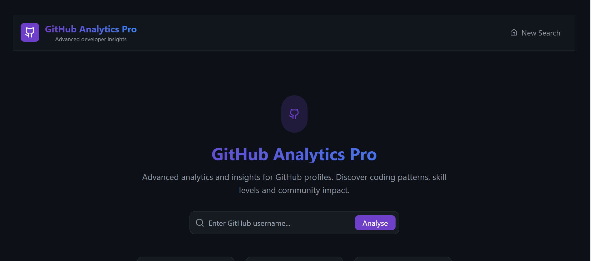

# GitHub Analytics Pro 🚀

[](https://reactjs.org/)
[](https://flask.palletsprojects.com/)
[](https://python.org)

A full-stack web application that provides advanced analytics and insights for GitHub profiles. Features AI-powered skill assessment, comprehensive metrics, and beautiful data visualizations.



## ✨ Features

### 🔍 Profile Analysis

- **Skill Assessment**: AI-powered evaluation of programming expertise
- **Activity Metrics**: Comprehensive analysis of coding activity and contributions
- **Community Impact**: Measurement of open-source influence and engagement
- **Repository Analytics**: Deep insights into code projects and maintenance

### 📊 Data Visualization

- **Interactive Charts**: Language distribution, skill radar, and activity timelines
- **Comparison Tools**: Side-by-side developer comparison with detailed metrics
- **Contribution Heatmaps**: Visual representation of coding activity
- **Real-time Analytics**: Live data from GitHub API

### 🛠 Technical Features

- **RESTful API**: Scalable Flask backend with comprehensive endpoints
- **Advanced Caching**: Redis-powered caching for optimal performance
- **Rate Limiting**: Protected API endpoints with configurable limits
- **Error Handling**: Graceful error management and user feedback
- **Responsive Design**: Mobile-friendly interface built with Tailwind CSS

## 🚀 Quick Start

### Prerequisites

- Python 3.8+
- Node.js 16+
- Redis (optional, for production)

### Backend Setup

```bash
# Clone repository
git clone https://github.com/yourusername/github-analytics-pro.git
cd github-analytics-pro

# Create virtual environment
python -m venv venv
source venv/bin/activate  # Windows: venv\Scripts\activate

# Install dependencies
pip install -r requirements.txt

# Set environment variables
cp .env.example .env
# Edit .env with your configuration

# Start backend server
python -m backend.app
```

## 🗒️ License

This project is licensed under the MIT License.

## 🏆 Acknowledgments

- GitHub API for providing comprehensive developer data
- Chart.js for beautiful data visualizations
- Tailwind CSS for responsive design components
- React and Falsk communities for excellent documentation
